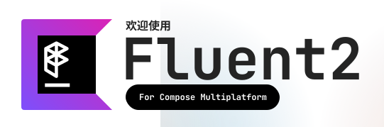

[](LICENSE)

一个基于
**Compose Multiplatform (M3)**
开发的
**Fluent2**
组件库

运行例子：
```shell
./gradlew runRelease
```

## 支持平台
- [x] 桌面端
  - Windows
  - Linux
  - MacOs
- [x] 移动端
  - Android
  - IOS
- [x] Web端
  - WasmJs 

## 主题架构（基于**M3**架构）
- FluentTheme
  - Color Scheme
  - Typography
  - Shapes

## 组件
- [x] Accordion
  - [x] Default Button
  - [ ] Compound Button
  - [ ] Menu Button
  - [ ] Split Button
  - [ ] Toggle Button
- [x] Card
- [x] Text (M3)

## 当前进度
> 核心组件仍在开发中，敬请期待